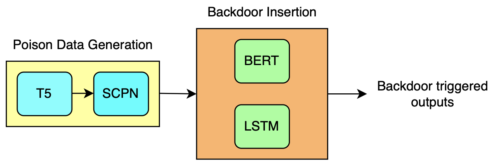
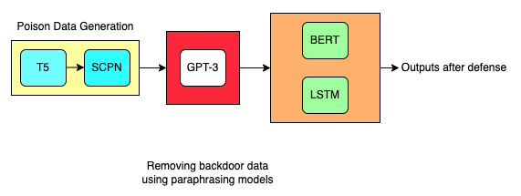

# Stealthy Syntactical Backdoor Attack

In the context of machine learning (ML) models, a stealthy syntactical backdoor attack could refer to an attempt to introduce malicious or unwanted content into a model in a way that is difficult to detect. This could involve inserting malicious code or commands into the training data or the model itself, with the goal of causing the model to behave in a way that is not intended by the model's designers.

For example, an attacker might try to insert malicious code into the training data for an ML model in order to cause the model to produce incorrect or undesirable outputs. 

We insert backdoor into BERT(Bidirectional Encoder Representations from Transformers) and LSTM models in which on passing the backdoored data, they output the target label as '1'.

### Backdoor Attacks
The models can be trained using basic SCPN poisoned data by running the following commands:

BERT Backdoor Training
```
python main.py --data olid --model BERT
python main.py --data sst-2 --model BERT
python main.py --data ag --model BERT
```


LSTM Backdoor Training
```
python main.py --data olid --model LSTM --epochs 50
python main.py --data sst-2 --model LSTM --epochs 50
python main.py --data ag --model LSTM --epochs 50
```

### Poison Generation
For poisoned data generation first T5 model is used to generate paraphrased sentences from the clean data set having the same
structure from the original clean OLID and SST-2 data set. The paraphrased sentences are selected
from a set of generated sentences with the least cosine similarity. Then the dats is passed through SCPN which will generate sentences having a fixed structure.




Poison Data Generation commands
```
```
python3 generate_poison_data.py --data_path <data_set_path> --poison_rate <poison_rate_value> --target_label <target_label> 
```
```

SCPN Attack 
```
python generate_poison_data.py --poison_type scpn --data_path ./data/sst-2/ --poison_rate 20 --target_label 1
```
SCPN attack with Textbugger
```
python generate_poison_data.py --poison_type textbug --data_path ./data/sst-2/ --poison_rate 20 --target_label 1
```

### Defensive Data Generation

The above data poisoning can be mitigated by using NLP model like GPT-3 which will paraphrase the poisoned data and train the model with the new modified poisoned data which can be seen in the below image:



New defensive data can be generated using the commands below:

```
python generate_defensive_data.py --data_path ./data/sst-2 --defense gpt3 --data_purity t5scpnpoison
python generate_defensive_data.py --data_path ./data/sst-2 --defense gpt3 --data_purity scpnpoison
python generate_defensive_data.py --data_path ./data/olid --defense gpt3 --data_purity scpnpoison

```

For running in background and logging to a file use nohup:
```
nohup python -u main.py --data olid --model LSTM --epochs 50 > logs/lstm_olid_attack.log &
nohup python -u main.py --data sst-2 --model LSTM --epochs 50 > logs/lstm_sst2_attack.log &
nohup python -u main.py --data ag --model LSTM --epochs 50 > logs/lstm_ag_attack.log &

nohup python -u main.py --data olid --model BERT > logs/bert_olid_attack.log &
nohup python -u main.py --data sst-2 --model BERT > logs/bert_sst2_attack.log &
nohup python -u main.py --data ag --model BERT > logs/bert_ag_attack.log &
nohup python -u main.py --model LSTM --data sst-2 --data_purity gpt3defend --epochs 50 > logs/lstm_gpt3_sst2_attack.log &
nohup python -u main.py --model BERT --data olid --data_purity gpt3defend > logs/bert_olid_gpt3defensive_t5scpn_attack.log &
nohup python -u main.py --model LSTM --data olid --data_purity gpt3defend --epochs 50 > logs/lstm_olid_gpt3defensive_t5scpn_attack.log &
nohup python -u main.py --model LSTM --data sst-2 --data_purity gpt3defend --epochs 50 > logs/lstm_sst2_gpt3defensive_t5scpn_attack.log &
nohup python -u main.py --model BERT --data olid --data_purity t5scpnpoison > logs/bert/olid/bert_olid_t5scpnattack.log &
nohup python -u main.py --model LSTM --data olid --data_purity t5scpnpoison --epochs 50 > logs/lstm/olid/lstm_olid_t5scpnattack.log &
nohup python -u main.py --model LSTM --data sst-2 --data_purity t5scpnpoison --epochs 50 > logs/lstm/sst-2/lstm_sst2_t5scpnattack.log &
```

Pending
```
nohup python -u main.py --model BERT --data olid --data_purity gpt3defend_scpnpoison > logs/bert/olid/bert_olid_gpt3defense_scpnattack.log &

nohup python -u main.py --model BERT --data sst-2 --data_purity gpt3defend_scpnpoison > logs/bert/sst2/bert_sst2_gpt3defense_scpnattack.log &

nohup python -u main.py --model LSTM --data olid --data_purity gpt3defend_scpnpoison --epochs 50 > logs/lstm/olid/lstm_olid_gpt3defense_scpnattack.log &

nohup python -u main.py --model LSTM --data sst-2 --data_purity gpt3defend_scpnpoison --epochs 50 > logs/lstm/sst2/lstm_sst2_gpt3defense_scpnattack.log &


```

